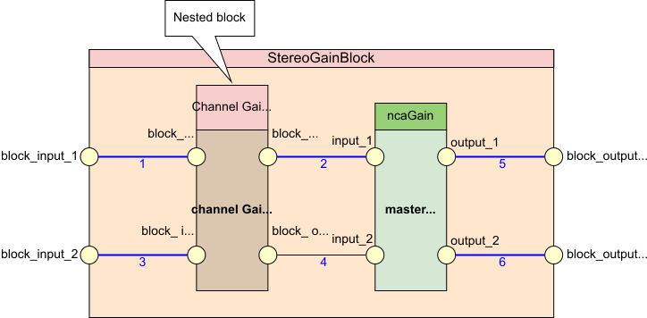
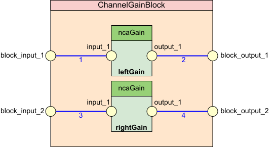

# Stereo audio gain with nested block

The following is a blockspec for a two-channel audio gain control block that includes a nested block that adjusts individual channel gains. This example also shows the use of the speclib library features, which include the specLibId property of the block member, and the Libraries table elsewhere in the document.

The block diagrams for the main block and nested block are as follows:





Here is the blockspec for the outer block, `StereoGainBlock`:

```json
{
    "specId": "StereoGainBlock",
    "specVersion": "1.0.0",
    "specDescription": "Stereo gain block spec",
    "members": [
            {
                "role": "stereoGain",
                "specId": "ChannelGainBlock",
                "specVersion": "1.0.0",
                "comment": "NcBlock",
                "classId": [ 1, 1 ],
                "classVersion": "1.0.0",
                "ports": [
                    {
                        "portName": "stereo_gain_input_1",
                        "direction": "input"
                    },
                    {
                        "portName": "stereo_gain_input_2",
                        "direction": "input"
                    },
                    {
                        "portName": "stereo_gain_output_1",
                        "direction": "output"
                    },
                    {
                        "portName": "stereo_gain_output_2",
                        "direction": "output"
                    }
                ],
                "constraints": [
                        {
                            "path": "left",
                            "propertyId": {
                                    "level": 5,
                                    "index": 1
                            },
                            "comment": "NcGain gainValue property",
                            "minimum": -20,
                            "maximum": 0
                        },
                        {
                            "path": "right",
                            "propertyId": {
                                    "level": 5,
                                    "index": 1
                            },
                            "comment": "NcGain gainValue property",
                            "minimum": -20,
                            "maximum": 0
                        }
                ]
            },
            {
                "role": "masterGain",
                "classId": [ 1, 2, 1, 1, 1 ],
                "classVersion": "1.0.0",
                "ports": [
                        {
                            "portName": "input_1",
                            "direction": "input"
                        },
                        {
                            "portName": "input_2",
                            "direction": "input"
                        },
                        {
                            "portName": "output_1",
                            "direction": "output"
                        },
                        {
                            "portName": "output_2",
                            "direction": "output"
                        }
                ],
                "constraints": [
                        {
                            "propertyId": {
                                    "level": 5,
                                    "index": 1
                            },
                            "comment": "NcGain gainValue property",
                            "minimum": -50,
                            "maximum": 10
                        }
                ]
            }
    ],
    "ports": [
            {
                "portName": "block_input_1",
                "direction": "input"
            },
            {
                "portName": "block_input_2",
                "direction": "input"
            },
            {
                "portName": "block_output_1",
                "direction": "output"
            },
            {
                "portName": "block_output_2",
                "direction": "output"
            }
    ],
    "signalPaths": [
            {
                "source": {
                        "path": [],
                        "portName": "block_input_1"
                },
                "sink": {
                        "path": [ "stereoGain" ],
                        "portName": "stereo_gain_input_1"
                },
                "pathName": "path_1"
            },
            {
                "source": {
                        "path": [ "stereoGain" ],
                        "portName": "stereo_gain_output_1"
                },
                "sink": {
                        "path": [ "masterGain" ],
                        "portName": "input_1"
                },
                "pathName": "path_2"
            },
            {
                "source": {
                        "path": [ "masterGain" ],
                        "portName": "output_1"
                },
                "sink": {
                        "path": [],
                        "portName": "block_output_1"
                },
                "pathName": "path_5"
            },
            {
                "source": {
                        "path": [],
                        "portName": "block_input_2"
                },
                "sink": {
                        "path": [ "stereoGain" ],
                        "portName": "stereo_gain_input_1"
                },
                "pathName": "path_3"
            },
            {
                "source": {
                        "path": [ "stereoGain" ],
                        "portName": "stereo_gain_output_2"
                },
                "sink": {
                        "path": [ "masterGain" ],
                        "portName": "input_2"
                },
                "pathName": "path_4"
            },
            {
                "source": {
                        "path": [ "masterGain" ],
                        "portName": "output_2"
                },
                "sink": {
                        "path": [],
                        "portName": "block_output_2"
                },
                "pathName": "path_6"
            }
    ]
}
```

Here is the blockspec for the inner gain block, `ChannelGainBlock`:

```json
{
    "specId": "ChannelGainBlock",
    "specVersion": "1.0.0",
    "specLibId": "basicAudio",
    "specDescription": "Two-channel audio gain control",
    "ports": [
            {
                "role": "block_input_1",
                "direction": "input"
            },
            {
                "role": "block_input_2",
                "direction": "input"
            },
            {
                "role": "block_output_1",
                "direction": "output"
            },
            {
                "role": "block_output_2",
                "direction": "output"
            }
    ],
    "signalFlows": [
            {
                "source": {
                        "path": [],
                        "role": "block_input_1"
                },
                "sink": {
                        "path": [ "leftGain" ],
                        "role": "input_1"
                }
            },
            {
                "source": {
                        "path": [ "leftGain" ],
                        "role": "output_1"
                },
                "sink": {
                        "path": [],
                        "role": "block_output_1"
                }
            }
    ],
    "members": [
            {
                "role": "left",
                "comment": "NcGain",
                "classId": [ 1, 2, 1, 1, 1 ],
                "classVersion": "1.0.0",
                "ports": [
                        {
                            "role": "input_1",
                            "direction": "input"
                        },
                        {
                            "role": "output_1",
                            "direction": "output"
                        }
                ]
            },
            {
                "role": "right",
                "classId": [ 1, 2, 1, 1, 1 ],
                "classVersion": "1.0.0",
                "comment": "NcGain",
                "ports": [
                        {
                            "role": "input_1",
                            "direction": "input"
                        },
                        {
                            "role": "output_1",
                            "direction": "output"
                        }
                ]
            }
    ]
}
```

Here is the libraries collection that goes at the beginning of the blockspec file and decodes library spec IDs mentioned in the blockspec:

```json
{
  "libraries": [
    {
      "reference": "stereoAudio",
      "location": "<AMWA repo link>"
    },
    {
      "reference": "basicAudio",
      "location": "<AMWA repo link>"
    }
  ]
}
```
